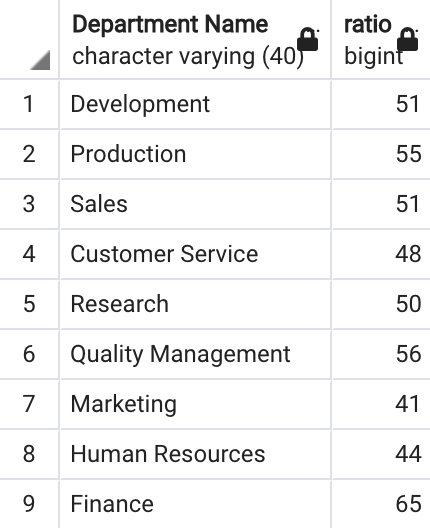

# Pewlett Hackard Analysis

## Overview of the Analysis

### Purpose

The purpose of the analysis is to determine the number of retiring employees by titles, where a retiring employee is defined as an employee that is born anyday during the 1952 to 1955 period, and the number of mentorship elegible employees, where a mentorship elegible employee is defined as currently employed and being born during the year 1965. On the other hand, additional queries where added to provide further inside and are presented in the "Summary" section below.

## Results

### Four Major Points from Deliverables

* The first major point to consider from the first deliverable is that the criteria that was chosen as to determine the retiring employees by titles is insuficient because it does not ensure that any given employee born between 1952 and 1955 is currently employed (this is corrected for in the "Summary" section below) and therefore the number of retiring employees as calculated by the first deliverable is overestimated.
* The second major point to consider as a consequence of the first point is that the number calculated for mentorship elegible employees is incomparable with the number calculated for retiring employees, as the criteria to calculate the former does ensure that mentorship elegible employee as currently employed while the latter does not. 
* There is a total of 90,398 retiring employees according to the first deliverable (see first bullet point).
* There is a total of 1,549 mentorship elegible employees (see second bullet point).

## Summary

(Queries performed to address the following questions are available in the Queries Folder of this repository, on Employee_Database_challenge.sql, in the "DELIVERABLE 3" section)

### How many roles will need to be filled as the "silver tsunami" (wave of retiring employees) begins to make an impact?

As discussed in the "Results" section (see first bullet point) the total number of retiring employees is overestimated, ajusting the criteria for counting titles that are currently employed, the total number of roles to be filled as the "silver tsunami" begins to make an impact is 80,109. 

### Are there enough qualified, retirement-ready employees in the departments to mentor the next generation of Pewlett Hackard employees?

Instructions provided as to what constitutes someone as "qualified" are ambiguous and therefore not accounted for in the calculation of an answer. Nevertheless to consider this question, a table was generated that shows the ratio of retiring employees by department to mentorship elegible employees by department. As the image below shows, that ratio is considerable and therefore it is unlikely that "there are enough qualified, retirement-ready employees in the departments to mentor the next generation...". However, that ratio is relevant in a scenario in which retiring employees would all do so at the same point in time, but considering that that is not likely, and recalling that retiring employees are defined as born in a 3 year span while mentors are defined as born in 1 specific year, the "Silver Tsunami" might be manageable through the mentorship program.

